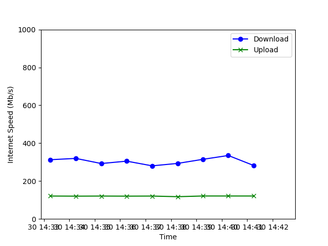

# Internet Speed Testing
This repository contains code that can perform experiments that measure the variability of internet connection speed over some period of time. To run an experiment, use the `run_speed_experiment()` function within `measure_speeds.py`. The user can specify how often they'd like to take measurements using the `frequency` argument and how long they'd like the experiment to last using the `duration` argument. Additionally, they can toggle real-time plotting as the experiment progresses using the `draw` argument.

The real-time plotting looks as below.

The output of `run_speed_experiment()` is a list of dictionary records, each containing the measured speeds as well as other relevant information such as the timestamp and server location. A full list of keys for each record can be found in the `RESULTS_COLS` and `SERVER_COLS` variables in `measure_speeds.py`.